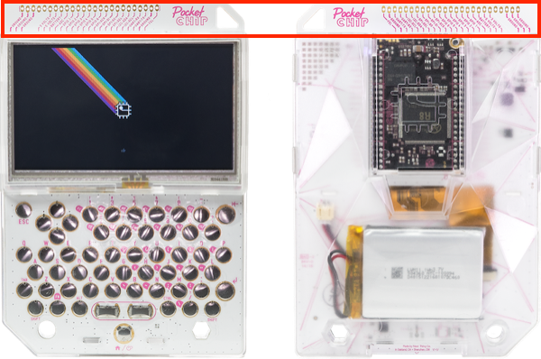

# the-s-in-iot

> The S in IoT stands for security

Security on resource constrained devices is tough. Even more so when business models have not evolved, and people are not making enough money to not cut corners.

Recently, a lot is being discussed about in the context of fixing this - checklists, certifications enforced by governments and so on. It would be a cool idea to have a free (as in freedom) tool to help one build, test and develop more secure connected devices.

## Building blocks

#### Hardware

[PocketC.H.I.P. by Next Thing Co](https://github.com/NextThingCo/PocketCHIP-PCB) is an open source Linux field terminal. It comes with Bluetooth and Wi-Fi on board. The most interesting part is the exposed pin headers as shown below



##### Also see
- El Kentaro has done a pretty sweet job with [HackerChip](https://medium.com/@elkentaro/hackerchip-v-1-part-1-of-n-59804d27c245)

#### Software
- The [software that comes with the PocketC.H.I.P.](https://docs.getchip.com/pocketchip.html#license) is pretty standard too - U-Boot, mainline Linux 4.3, Debian 8. There are some parts which might not be ```such FOSS, much AWESOME```, but those could be removed easily. 
- More tbd


#### CLI

##### ```siniot --discover <interface>```

##### ```siniot --info <device_name>```

```
$ siniot --info Yeelight
Company - Xiaomi

Models  - 
	YLXD01YL Yeelight LED Ceiling Light
	MJTD01YL Mi LED Desk Lamp
	...
	
Developer -
	API     - Open 
	API URL - https://www.yeelight.com/en_US/developer
```
